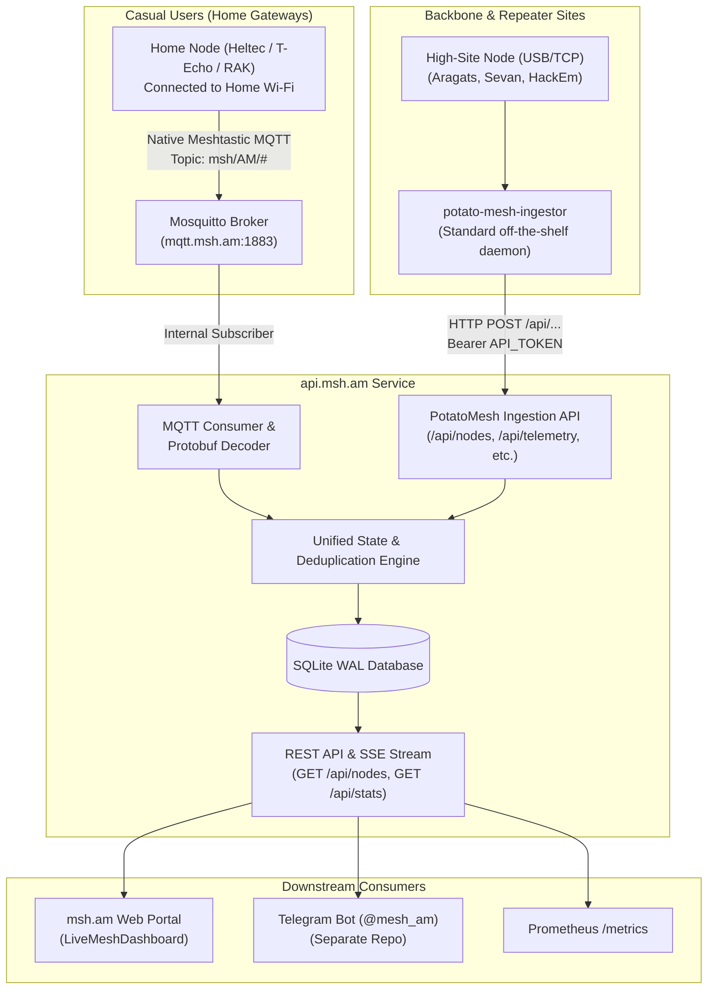

# 📡 Meshtastic Armenia Community API (`api.msh.am`)

Backend service and ingestion engine for the [Meshtastic Armenia Community (msh.am)](https://msh.am).

This service acts as the central data bridge between the physical Armenian LoRa mesh (**EU_868 MediumFast**) and community platforms:
1. **[msh.am Live Mesh Dashboard](https://msh.am/dashboard)** — real-time active node directory, telemetry, battery monitoring, and spectrum load.
2. **Community Telegram Chat ([@mesh_am](https://t.me/mesh_am))** — dedicated `/api/status/telegram` endpoint consumed by an external bot to maintain an auto-updating pinned message.
3. **Prometheus Monitoring (`/metrics`)** — node and channel health metrics for Grafana.

---

## 🏛️ Architecture: Dual-Ingestion Hybrid Model

To maximize community participation without forcing casual users to run server software, the backend supports **two concurrent ingestion paths**:



### 1. PotatoMesh-Ingestor Protocol (HTTP POST)
For backbone operators running high-site repeaters (Mount Aragats, Lake Sevan, Hacker Embassy `hackem.cc`).
- Operators run the standard, off-the-shelf [`potato-mesh-ingestor`](https://github.com/l5yth/potato-mesh).
- The ingestor connects via USB Serial or TCP to the radio and forwards ground-truth RF packets over authenticated HTTP:
  - `POST /api/nodes`
  - `POST /api/telemetry`
  - `POST /api/positions`
  - `POST /api/messages`
  - `POST /api/neighbors`
  - `POST /api/traces`
  - `POST /api/ingestors`

### 2. Native Meshtastic MQTT Ingestion (`mqtt.msh.am`)
For community home nodes using standard Meshtastic firmware over Wi-Fi:
- **No extra software needed**: Users simply toggle MQTT in the official Meshtastic app:
  - **Module Config** → **MQTT** → **ON**
  - **Server Address**: `mqtt.msh.am`
  - **Uplink Enabled**: `YES`
  - **Downlink Enabled**: `NO`
  - **Topic Root**: `msh/AM`
- The backend's background subscriber ingests and parses protobuf packets (`mesh_pb2`, `telemetry_pb2`, `portnums_pb2`, `config_pb2`) directly into the database.

---

## 🚀 Getting Started

### Using Nix / NixOS (Recommended)

Enter the development environment with all dependencies (Python 3.13, FastAPI, meshtastic, paho-mqtt, mosquitto, sqlite):

```bash
nix-shell
# or with flakes:
nix develop
```

Start the API server:
```bash
uvicorn src.main:app --reload --host 0.0.0.0 --port 8000
```

Seed Armenian mesh nodes into the local database:
```bash
python3 scripts/seed_armenia_mesh.py
```

Run test suite:
```bash
pytest -v
```

### Using Docker Compose

Run Mosquitto (`mqtt.msh.am`) and `api-msh-am` together:

```bash
docker compose up -d
```

---

## 🔌 API Endpoints Reference

| Method | Path | Description | Notes |
| :--- | :--- | :--- | :--- |
| `GET` | `/healthz` | Liveness health check | Returns `{"status": "ok"}` |
| `GET` | `/version` | Instance info & frequency parameters | PotatoMesh compatibility |
| `GET` | `/api/nodes` (or `/nodes`) | Active and registered nodes directory | Formatted for `msh.am` LiveMeshDashboard |
| `GET` | `/api/nodes/:id` | Single node detail with telemetry & position history | Returns 50 most recent records |
| `GET` | `/api/stats` | Network health & statistics | Total nodes, online count, active routers, avg battery |
| `GET` | `/api/status/telegram` | Summary payload for Telegram pinned message | Includes pre-rendered Markdown string |
| `GET` | `/api/messages` | Public channel message archive | Supports `?limit=` and `?channel=` |
| `GET` | `/api/events` | Server-Sent Events (SSE) live stream | Real-time push for new packets & telemetry |
| `GET` | `/metrics` | Prometheus metrics exporter | For Grafana scraping |
| `POST` | `/api/nodes` | Ingest node metadata | Requires `Authorization: Bearer <API_TOKEN>` |
| `POST` | `/api/telemetry` | Ingest battery & channel load | Requires `Authorization: Bearer <API_TOKEN>` |
| `POST` | `/api/positions` | Ingest GPS location | Requires `Authorization: Bearer <API_TOKEN>` |
| `POST` | `/api/messages` | Ingest public message packet | Requires `Authorization: Bearer <API_TOKEN>` |
| `POST` | `/api/neighbors` | Ingest RF link neighbors | Requires `Authorization: Bearer <API_TOKEN>` |
| `POST` | `/api/ingestors` | Ingestor heartbeat | Requires `Authorization: Bearer <API_TOKEN>` |

---

## 🔒 Privacy & Safety Rules

1. **`ignore_mqtt` respect**: When a node configures `lora.ignore_mqtt = true`, the API automatically drops and omits GPS coordinates from public endpoints.
2. **Encrypted Channel Isolation**: Secondary encrypted channels (AES-256) are never decrypted or archived. Only metadata from public community channels (`AQ==`) is stored.
3. **Optional Coordinate Fuzzing**: Can be enabled via `ENABLE_LOCATION_FUZZING=true` to truncate client coordinates to ~1 km radius to protect residential privacy.

---

## 📜 License

Licensed under the **GNU General Public License v3.0 (GPL-3.0)**, matching upstream Meshtastic.
Meshtastic® is a registered trademark of Meshtastic LLC.
